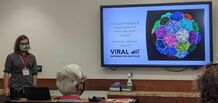
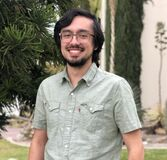
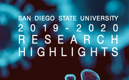

# Luque Lab News
| [**Student Research Symposium(Envision)**](#student-research-symposium-2024-10-4)| October 4, 2024 | 
| Undergraduate student,[**Jose-Bernard Sedalo**](Team/index.md/#jose-bernard-sedalo) displayed his project on identification of disassembly units in viral capsids. Jose took home third place in the STEM category for his presentation.|  |

| [**The Luque lab migrates its website to GitHub**](#luque-lab-migrates-website-to-github-2023-12-28) | December 28, 2023 |
| The Luque lab has migrated its website from Weebly to GitHub to power the new lab website: <https://luquelab.github.io/website>. The website's content is available as a [GitHub repository](https://github.com/luquelab/website) under the [luquelab GitHub organization](https://github.com/luquelab). The new HTML website is a GitHub-page site that uses the [Just the Docs](https://github.com/just-the-docs/just-the-docs) documentation theme for Jekyll. Housing the website in GitHub facilitates version control, integration with other lab repositories and documentation, and a great environment to train new lab members to use GitHub right after joining the team. |  |

| [**Publication of pyCapsid in Bioinformatics**](#publication-of-pycapsid-in-bioinformatics-2023-12-19) | December 19, 2023 |
| The lab members, Colin Brown, Anu Agarwal, and Antoni Luque [have published](https://doi.org/10.1093/bioinformatics/btad761) the new structural bioinformatics, [pyCapsid](https://luquelab.github.io/pyCapsid/), in [Bioinformatics from Oxford Academic](https://academic.oup.com/bioinformatics). This new structural bioinformatics tool developed by the Luque lab identifies quasi-rigid domains and disassembly units in capsids and other large macromolecular complexes. The code is available as a [GitHub repository](http://github.com/luquelab/pyCapsid), which includes an [online documentation](https://luquelab.github.io/pyCapsid/) with tutorials. pyCapsid is available as a [cloud-based Google Colab notebook](https://colab.research.google.com/github/luquelab/pyCapsid/blob/main/notebooks/pyCapsid_colab_notebook.ipynbpyca) and can be installed locally as a python package via [PIP](https://pypi.org/project/pyCapsid/git) and [Conda](https://anaconda.org/luque_lab/pycapsid). |  | 

| [**The Luque lab moves to Miami**](#luque-lab-moves-to-miami-2023-08-15) | August 15, 2023 |
| The Luque lab has [officially joined](https://biology.as.miami.edu/people/meet-our-new-faculty/index.html) the [Department of Biology](https://biology.as.miami.edu) at the [University of Miami](https://welcome.miami.edu). After eight years (since 2015) of forming part of the Viral Information Institute at San Diego State University, it was time to start a new adventure, offering more resources and opportunities for the scientific and educational mission of the lab. |  |

| [**Outstanding scholar-athlete award**](#outstanding-scholar-athlete-award-2023-04-26) | April 26, 2023 |
| Undergraduate student [Caitlin Bartels](Team/index.md/#caitlin-bartels) won the Outstanding Scholar Athlete Award at the [SDSU Sports Clubs 2023](https://arc.sdsu.edu/sportclubs) Awards Banquet. Caitlin was selected out of hundreds of athletes across 22 different sports for this recognition, representing the Women’s Club Water Polo team. The award goes to the athlete who excelled in their respective sport, demonstrated incredible academic achievements, and was involved in on-campus and off-campus extracurricular activities. |  |

| [**The Promise and Pitfalls of Prophages**](#the-promise-and-pitfalls-of-prophages-2023-04-21) |  April 21, 2023 |
| The lab PI [Antoni Luque](Team/index.md/#antoni-luque) contributed to the analysis of the largest dataset of viruses integrated in bacteria (prophages) in an international project led by the Director of the Flinders Accelerator for Microbiome Exploration ([FAME](https://fame.flinders.edu.au/), [Rob Edwards](https://www.flinders.edu.au/people/robert.edwards). The findings were shared as a bioRxiv manuscript titled "[The Promise and Pitfalls of Prophages](https://doi.org/10.1101/2023.04.20.537752)". |  |

| [**Viral predation pressure on coral reefs**](#viral-predation-pressure-on-coral-reefs-2023-04-11) |  April 11, 2023 |
| The project led by the Lab PI [Antoni Luque](https://scholar.google.com/citations?hl=en&user=ytvnI68AAAAJ&view_op=list_works&sortby=pubdate) was released on [BMC Biology](https://bmcbiol.biomedcentral.com/) titled "[Viral predation pressure on coral reefs](https://doi.org/10.1186/s12915-023-01571-9)". |  |

| [**New Computational tool for Capsids**](#new-computational-tool-for-capsids-2023-03-01) |  March 1, 2023 |
| The lab Project led by masters student [Colin Brown](https://www.linkedin.com/in/colin-travis-brown) was released on [BioRxiv](https://www.biorxiv.org/) titled "[pyCapsid: Identifying dominant dynamics and quasi-rigid mechanical units in protein shells](https://www.biorxiv.org/content/10.1101/2023.02.27.529640v1)". The package [pyCapsid](https://luquelab.github.io/pyCapsid/) is available on [GitHub](https://github.com/luquelab/pyCapsid), [Conda](https://anaconda.org/luque_lab/pycapsid) and [PIP](https://pypi.org/project/pyCapsid/) and the package installation steps are described [here](https://luquelab.github.io/pyCapsid/installation/). |  |

| [**Application Submitted to NSF GRFP**](#application-submitted-to-nsf-grfp-2022-10-21) |  October 21, 2022 |
| Masters student Aurora Vogel submitted an application for the [National Science Foundation Graduate Research Fellowship Program](https://www.nsfgrfp.org) (GRFP). GRFP recognizes and supports outstanding graduate students who have demonstrated the potential to be high achieving scientists and engineers, early in their careers.  Vogel is investigating the geometry of conical capsids (like HIV) in the Luque lab and is a prospective Ph.D. student in Mathematics. |  |

| [**Invited seminar at UM**](#invited-seminar-at-UM-2022-09-21) | September 21, 2022 |
| Principal Investigator, Dr. Antoni Luque, was invited as a speaker at the Fall 2022 seminar series  in the Department of Physics at the University of Miami (UM). Dr. Luque shared the lab's progress in bridging the biophysics and evolution of viral capsids. The seminar was hosted by Prof. Vivek N. Prakash. The seminar was preceded by a coffee with graduate students, postdocs, and other faculty. |  |

| **[Invited seminar at SDSU](https://www.sdsu.edu/)** | September 14, 2022 |
| Masters student Aurora Vogel was an invited speaker in the [Fall 2022 seminar series](https://cdoneill.sdsu.edu/sgpsrs/) at San Diego State University (SDSU). Aurora shared her current research progress in developing a general geometric framework for describing viral architectures. The seminar was hosted by [Professor Chris O'Neill](https://cdoneill.sdsu.edu/). |  |

| **[Invited seminar at UM](https://welcome.miami.edu/)** | August 29, 2022 |
| Principal Investigator, Dr. Antoni Luque, was the first invited speaker in the [Fall 2022 seminar series](https://biology.as.miami.edu/about-the-department/seminars/index.html) of the [Department of Biology](https://biology.as.miami.edu/) at the University of Miami (UM). Dr. Luque shared [the lab's progress](https://www.luquelab.com/publications.html) in bridging the biophysics and evolution of viral capsids. The seminar was hosted by [Prof. Alex Wilson](https://people.miami.edu/profile/6b8ff48cc6302817e386e1d15db36a1d) , and it was followed by a lunch with graduate students. |  |

| **[Invited seminar at FAME, Flinders University, Australia](https://fame.flinders.edu.au/)** | August 17, 2022 |
| Principal Investigator, Dr. Antoni Luque, visited the Flinders Accelerator for Microbiome Exploration [(FAME)](https://fame.flinders.edu.au/) at [Flinders University]((https://www.flinders.edu.au/) (Adelaide, Australia) to present the latest progress of the Luque lab in the prediction of viral capsids from metagenomic data. The directors of the center, Professors Rob Edwards and Liz Dinsdale, hosted the research visit. |  |

| **[Poster contributions to the Virus of Microbes meeting](https://www.pprpffa.org/)** | July 20, 2022 |
| Postdoctoral researcher, [Dr. Sergio Cobo-López](https://scholar.google.com/citations?hl=en&user=m6m1HV4AAAAJ) presented a poster on his new approach to analyzing transient dynamics and its potential application to viral ecology at the international [Virus of Microbes](https://www.pprpffa.org/) (VoM) meeting, which took place in Guimarães (Portugal). Principal investigator, Dr. Antoni Luque, also presented a poster highlighting the lab's progress in predicting the capsid architecture of viruses from metagenomic data. |  |

| **[Talk contribution to the Virus Structure and Assembly Conference](https://www.faseb.org/meetings-and-events/src-events/the-virus-structure-and-assembly-conference)**| June 27, 2022 |
| Principal Investigator, Dr. Antoni Luque, gave a talk at the international [FASEB Virus Structure and Assembly Conference](https://www.faseb.org/meetings-and-events/src-events/the-virus-structure-and-assembly-conference) that took place in Southbridge, Massachusetts (USA). Dr. Luque shared the latest work of the lab in predicting the architecture of viral capsids from isolated and metagenomically assembled genomes. The talk highlighted the recent publication led by Ph.D. candidate [Diana Y. Lee](https://sciences.sdsu.edu/math-is-magical/) in the [Computational and Structural Biotechnology Journal](https://www.sciencedirect.com/science/article/pii/S2001037021005419?via%3Dihub). |  |

| **[Invited talk at the evolution series of El Colegio Nacional in Mexico City](https://colnal.mx/agenda/en-busca-de-los-virus-perdidos/)** | June 10, 2022 |
| Dr. Antoni Luque was invited by Professor [Antonio Lazcano](https://scholar.google.com/citations?hl=en&user=GR95_iMAAAAJ) to contribute to the evolution series [Los Viernes de la Evolución at El Colegio Nacional](https://colnal.mx/agenda/en-busca-de-los-virus-perdidos/). Dr. Luque gave the first contribution in person in the cycle after the event had operated online for two years due to the pandemic. Dr. Luque shared his lab's research findings about identifying some of the most ancestral viruses related to tailed bacteriophages (the most abundant viruses on the planet). The talk was in Spanish and was titled "En busca de los virus perdidos". It was broadcasted across multiple Latin American countries and is available online on [YouTube](https://www.youtube.com/watch?v=Rw0Z89nUNsA&ab_channel=elcolegionacionalmx). After the talk, El Colegio Nacional published a [press release](https://colnal.mx/noticias/los-virus-estan-adaptando-funciones-nuevas-y-han-ayudado-a-diferentes-organismos-a-evolucionar-antoni-luque-santolaria/) summarizing the most relevant aspects of the talk and the conversation that followed with Prof. Lazcano and the audience. |  |

| **[International Virus Bioinformatics Meeting 2022](https://evbc.uni-jena.de/events/vibiom2022/)** | March 23, 2022 |
| The Luque lab presented the latest findings on how to predict the capsid architecture of viruses in metagenomes at the [International Virus Bioinformatics Meeting 2022](https://evbc.uni-jena.de/events/vibiom2022/) on 23-25 March 2022. An extended summary of the contribution has been published in the [Virus Bioinformatics conference report](https://www.mdpi.com/1999-4915/14/5/973) in the journal Viruses. |  |

| **[Invited talk at UC Merced](https://appliedmath.ucmerced.edu/events/mathematical-biology-seminar-17)** | March 9, 2022 |
| The principal investigator Dr. Antoni Luque presented the latest research on "Bridging the biophysics and evolution of viruses" at [University of California Merced](https://www.ucmerced.edu/). The abstract of the talk can be viewed on the [UC Merced Applied Mathematics page](https://appliedmath.ucmerced.edu/events/mathematical-biology-seminar-17). |  |

| **[Student Research Symposium (SRS) 2022](https://research.sdsu.edu/research_affairs/student_research_symposium/srs_2022_program.pdf)** | Mar 4, 2022 |
| Caitlin Bartels a member of the [Luque Lab](https://www.luquelab.com/) presented a poster at the [SRS 2022](https://research.sdsu.edu/sdsu_student_symposium) at SDSU titled "Study of the 3D Molecular Structure of Viral Capsid Building Blocks. |  |

| **[Student Research Symposium (SRS) 2022](https://research.sdsu.edu/research_affairs/student_research_symposium/srs_2022_program.pdf)** | Mar 4, 2022 |
| Colin Brown a member of the [Luque Lab](https://research.sdsu.edu/research_affairs/student_research_symposium/srs_2022_program.pdf) presented a talk at the [SRS 2022](https://research.sdsu.edu/sdsu_student_symposium) at SDSU titled "Classifying Icosahedral Capsids via Quasi-Rigid Domain Subdivision. |  |

| **[CSRC colloquium](https://www.youtube.com/watch?v=l1ayjAqvY3w&ab_channel=SDSUComputationalScienceResearchCenter)** | Feb 11, 2022 |
| The principal investigator Dr. Antoni Luque presented the latest research on "Bridging the Biophysics and Evolution of Viruses" at the [CSRC](https://www.csrc.sdsu.edu/) Colloquium. Dr. Luque introduced the generalized quasi-equivalence theory of icosahedral architectures as a framework to investigate systematically viral architectures and their protein components, showed how the physical relationship between the protein shell and genome of viruses has opened the door to characterize uncultured viruses, predict the existence of unknown viruses, and engineer new viruses from the environment and discussed a novel physical mechanism that may hold the key to how viruses explore different viral architectures. The talk can be viewed on the [CSRC YouTube page](https://www.youtube.com/watch?v=l1ayjAqvY3w&ab_channel=SDSUComputationalScienceResearchCenter). |  |

| **[Math is magical](https://sciences.sdsu.edu/math-is-magical/)** | Feb 11, 2022 |
| [Diana Lee's](https://www.researchgate.net/profile/Diana-Lee-4) work associated with the [Luque Lab](https://www.luquelab.com/) and her journey to her [first author paper](https://www.sciencedirect.com/science/article/pii/S2001037021005419?via%3Dihub) identifying links between the shape and genes of virus has been highlighted by SDSU in the [College of Sciences website](https://sciences.sdsu.edu/). With data on hundreds of tail phages, the largest subgroup of bacteriophages, Diana refined a machine learning algorithm called a "random forest" which can predict which features of a virus's genome determine the shape of its shell. |  |

| **[Alumni publish capstone project findings on particle diffusion in mucus](https://physics.sdsu.edu/alumni-publish-capstone-project-findings-on-particle-flow-in-mucus/)**  |  Dec 17, 2021 |
| Antonio Cobarrubia's work associated with the Luque lab has been highlighted by SDSU in the Department of Physics website. Antonio developed his senior thesis in physics in the lab in a collaborative project with two other physics students, Jarod Tall and Austin Crispin-Smith. The research article has been published in [Frontier,s in Physics](htt,ps://www.frontiersin.org/articles/10.3389/fphy.2021.594306/full), comparing more than 100 published experiments of diffusion of particles in mucus and introducing a new framework for the anomalous diffusion of these particles. |  |

| **[Are you new here? Tracing the origin of viruses](https://newscenter.sdsu.edu/sdsu_newscenter/news_story.aspx?sid=78624)**  |  Dec 13, 2021 |
| With support from the [Gordon and Betty Moore Foundation](https://www.moore.org/), the [Luque lab](https://www.luquelab.com/) is exploring with three other groups at the Viral Information Institute ([Rohwer lab](https://coralandphage.org/), [Segall lab](https://segall-lab.sdsu.edu/), and [Edwards lab](https://cmi.sdsu.edu/matt-edwards/)) whether some viruses pop up spontaneously. |  |

| **[Postdoctoral researcher awarded with fellowship Margarita Salas](https://scholar.google.com/citations?hl=en&user=m6m1HV4AAAAJ)** | Nov 12, 2021 |
| Postdoctoral researcher [Dr. Sergio Cobo López](https://scholar.google.com/citations?hl=en&user=m6m1HV4AAAAJ) has been awarded the fellowship [Margarita Salas](https://scholar.google.com/citations?hl=en&user=m6m1HV4AAAAJ) from the Spanish Government to continue his research in phage-bacterial ecology and complex systems in biology during the next two years. He will be working with Principal Investigators Dr. Antoni Luque and [Dr. Forest Rohwer](https://scholar.google.com/citations?user=ALEZEdoAAAAJ&hl=en) at San Diego State University in 2023 and Principal Investigators [Dr. Roger Guimerà Manrique](https://scholar.google.com/citations?user=aDQtHNsAAAAJ&hl=en) and [Dr. Marta Sales-Pardo](https://scholar.google.com/citations?user=kZ5cedgAAAAJ&hl=en) from the [Sees:lab](http://seeslab.info/) at the [Universitat Rovira i Virgili](https://www.urv.cat/en/) in Spain. |  |

| **[Contribution to the SDSU Research Highlights](contribution-to-the-sdsu-research-highlights-2020-12-21)**  |  Dec 21, 2020 |
| The lab research on the architecture of viral capsids was selected by [San Diego State University](https://www.sdsu.edu/) in the [2019-20 Research Highlights](https://research.sdsu.edu/2020_research_highlights/luque). The lab accomplishments included a new framework to investigate icosahedral viral capsids published in *Nature Communications# ([Twarock and Luque, 2019](https://doi.org/10.1038/s41467-019-12367-3)) and a [National Science Foundation award](https://www.nsf.gov/awardsearch/showAward?AWD_ID=1951678&HistoricalAwards=false) from the Mathematical Biology program granted to the lab to predict the geometry of viral capsids. |  |

| **[CSRC colloquium](#csrc-colloquium-2022-10-16)** | Oct 16, 2022 |
| The principal investigator, Dr. Antoni Luque, shared the latest research from the lab on a seminar titled "Bridging the physics and evolution of viruses" at the Computational Science Research Center (CSRC) [Colloquium](https://www.csrc.sdsu.edu/colloquium_display.html?page=20201016) at San Diego State University. The talk can be watched on the [CSRC YouTube page](https://www.youtube.com/watch?v=_hDZhd3JUHE). |  |
