## Alumni 

| [**Diana Lee**](#diana-lee) | PHD Student 2016-2024  **TBD**|
|     Picture from ....    [LinkedIn](https://www.linkedin.com/in/diana-lee-98198a35/) |Diana joined the lab in the summer of 2015. As a returning student, she had just come back to SDSU to complete her BS in Applied Math with an emphasis in Biology. She responded to Dr. Luque’s request for a biomathematics researcher for the summer and quit her full-time job in a leap of faith. Diana graduated in Spring 2016 and then stayed on with Toni as part of the CSRC to pursue a doctorate in Computational Science in the JDP with Claremont Graduate University. Along the way, she was both an LSAMP and IMSD scholar, and was selected as a Viral Information Institute (VII) and CSRC GSTEM Fellow for her first two years of grad school. Diana helped restart the SDSU SIAM chapter, serving as President for the first year back, and was actively involved in SACNAS. She presented her work at SIAM CSE, the Grace Hopper Celebration, and ACSESS conferences, winning awards and gaining valuable contacts in the process. Throughout her studies, Diana faced setbacks with mental health, physical health, and family drama, which ultimately transformed her into an advocate for stronger support for returning graduate students, beyond the usual suggestion of ‘self-care’. She successfully defended her dissertation on June 21, 2024, and now she is returning to work in industry, hoping to continue doing work that can ultimately serve the greater good. As a queer Chicana and a product of the public school system, Diana feels a responsibility to give back to the family and community that supported her. When she’s not staring at her computer working, Diana spends time with one or both of her kids (24 & 11), her dog, three cats, and various plants, or plays TTRPGs with her spouse, reads, writes, and/or makes ridiculous things.|

| [**Colin Brown**](#colin-brown) | Master Student and Research Assistant-Scientist 2020–2023    **Junior Software Test Engineer at Holland AI LLC** since 2023 |
| 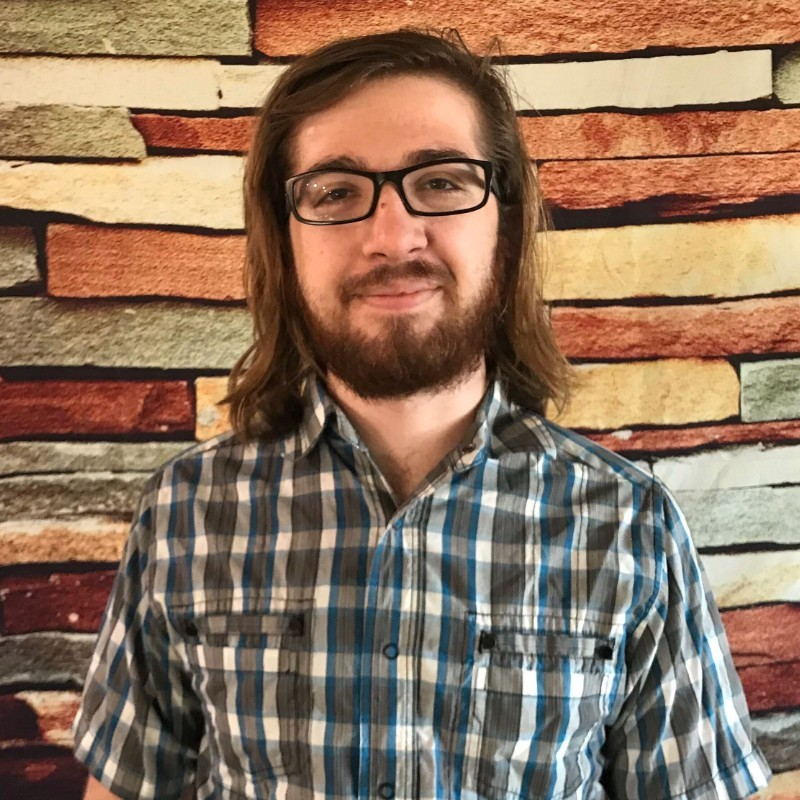    Picture from 2023    [LinkedIn]([?](https://www.linkedin.com/in/colin-travis-brown/)) | Colin was a research assistant and research scientist at the Luque lab from April 2020 to August 2023. Colin joined the lab to do research as part of his Master's thesis in physics, and he expanded his scope by developing geometrical and physical models to investigate the protein shell protecting the genome of viruses. He led the release and publication of pyCapsid in *Bioinformatics* and contributed to two additional research projects on viral capsids, yielding two co-author publications in *Microorganisms* and *bioRxiv*. Colin's position was supported by research funds from the National Science Foundation and the Gordon and Betty Moore Foundation. He received his Master's in Physics from San Diego State University in 2023. |

| [**Anuradha Agarwal**](#anuradha-agarwal) | Lab Technician 2022–2023    **Data Management Specialist at J.P. Morgan** since 2023 |
|     Picture from 2023    [LinkedIn](https://www.linkedin.com/in/anuradhagarwal/) | Anuradha (Anu) was a lab technician and manager at the Luque lab from January 2022 to May 2023. In the lab, Anuradha (Anu) was responsible for implementing, maintaining, and developing the data, computational, and culture processes operating in the lab. She developed extensive protocols and lab documentation and contributed to the first online release and publication of pyCapsid in *Bioinformatics*. Anu's position was supported by research funds from the National Science Foundation and the Gordon and Betty Moore Foundation. Anu received her Bachelor of Science in Mathematics from Rudgers University in 2021 and her Master in Computational Science from San Diego State University in 2023. While in the lab, she loved learning new languages and painting. | 

| [**Caitlin Bartels**](#caitlin-bartels) |Undergraduate Student 2020-2023   **Clinical Medical Assistant at [OC Spine and Sport Medicine](https://www.linkedin.com/company/ocspineandsports/)** since 2023 |
| 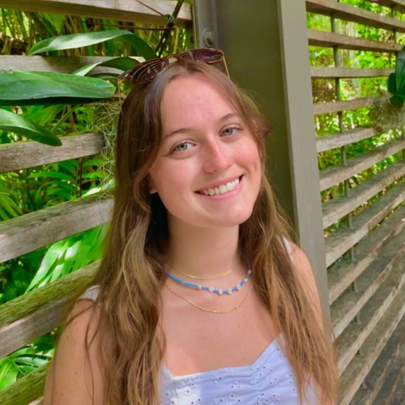    Picture from ...    [LinkedIn](https://www.linkedin.com/in/caitlin-bartels-a384891aa) | Caitlin was Biology undergrad at San Diego State University (SDSU) who joined Luque Labs in 2020 in the amidst of the Covid-19 pandemic, wanting to learn more about viruses. During on her time in the lab, she worked on a wide array of projects specifically related to capsid architecture and herpesvirales latency. She is currently on track to apply to medical school this coming cycle.  | 

| [**Amartya Yalla**](#amartya-yalla) | Master Students And Assistant Lab Manager   **TBD** <!--since .... --> |
| 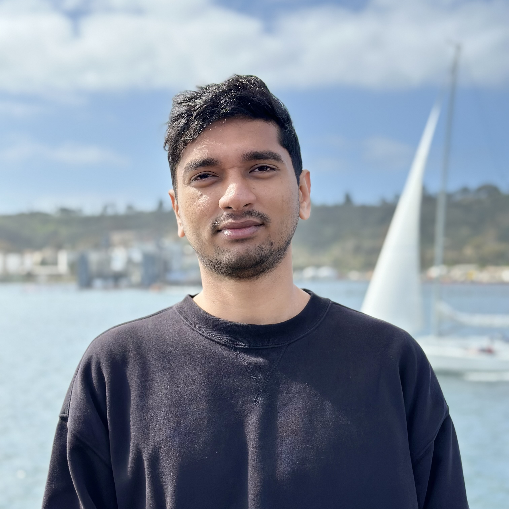    Picture from 2023    [LinkedIn](https://www.linkedin.com/in/amartya-yalla/) | Amartya, a Masters student studying computational science at San Diego State University(SDSU), joined the lab in 2023 as an assistant lab manager, helping to carry out and execute operational tasks. He will be completing his masters degree in 2024. | 

| [**Brandon Ricafrente**](#brandon-ricafrente) | Masters Student 2020-2023   **TBD** <!--since .... --> |
| 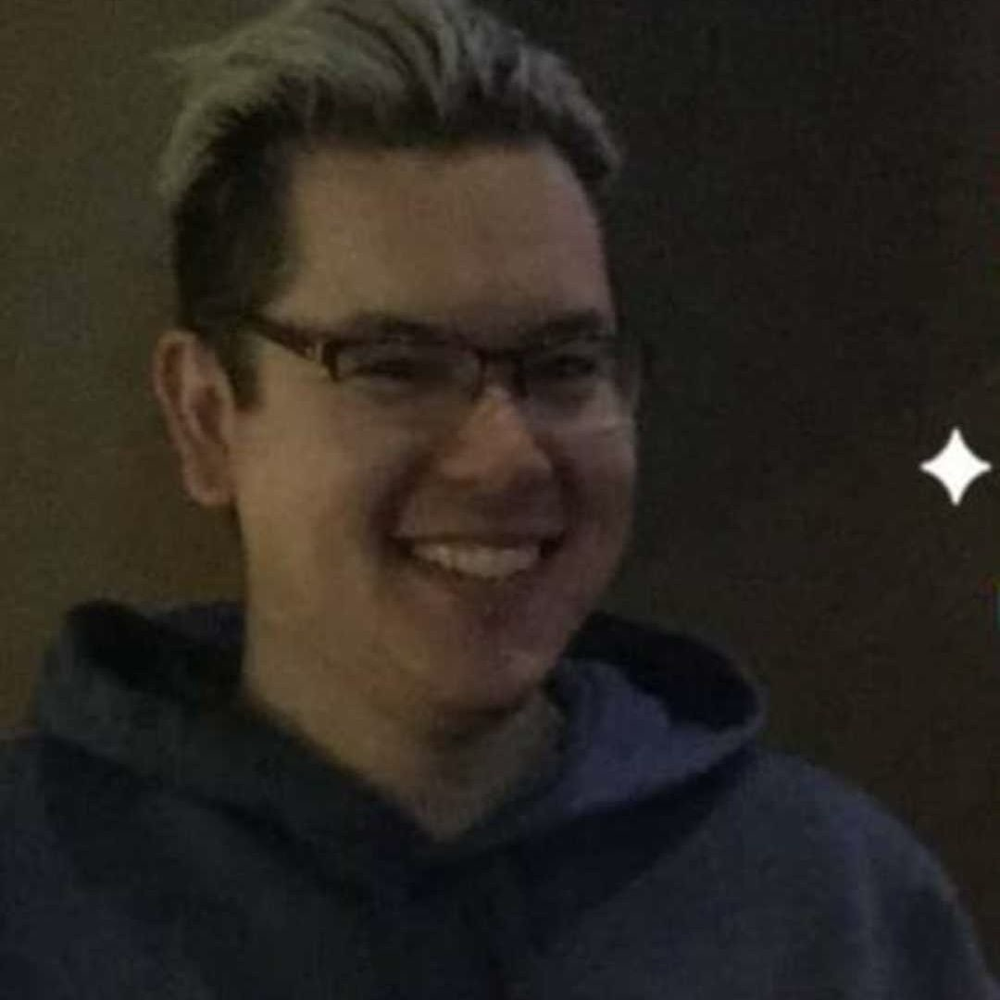    Picture from ...    [LinkedIn](https://www.linkedin.com/in/brandon-ricafrente-777806132/) | Brandon was a physics masters student who joined Luque Labs in 2020 to to study viral capsid assembly, after obtaining a B.S. in Physics with a minor in Math from University of California Riverside (UCR).  | 

| [**James Mullinix**](#james-mullinix) | PHD Student 2015-2020   **TBD** <!--since .... --> |
| 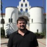    Picture from ...    [LinkedIn](https://www.linkedin.com/in/jamesmullinix/) | Description TBD.  | 

| [**Aurora Vogel**](#aurora-vogel) | Masters Student 2021-2023   **TBD** <!--since .... --> |
| 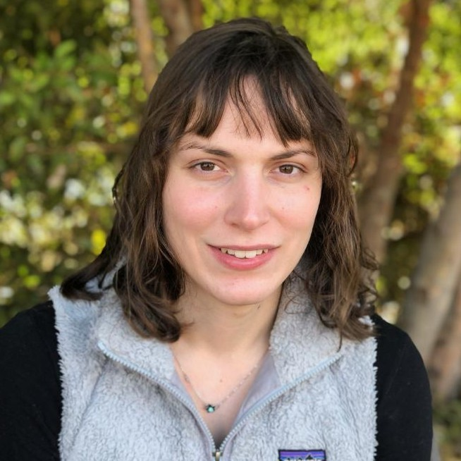    Picture from ...    [LinkedIn](https://www.linkedin.com/in/aurora-vogel-7b7186196/) | Description TBD.  | 

| [**Vaishnavi Patel**](#vaishnavi-patel) |Undergraduate Student ...-...   **TBD** <!--since .... --> |
| 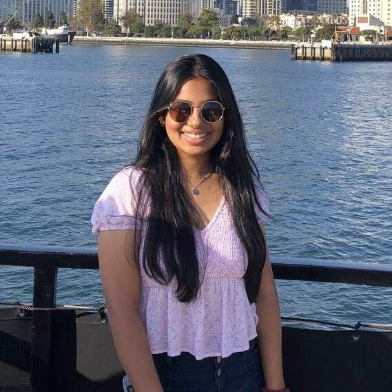    Picture from ...    [LinkedIn](#link) | Description TBD.  |

| [**Kevin Joiner**](#kevin-joiner) | Ph.D. Student and Research Assistant-Scientist 2015–2019    **Research Scientist at the [Naval Information Warfare Center (NIWC)](https://www.niwcpacific.navy.mil/careers/)** since 2020 |
| 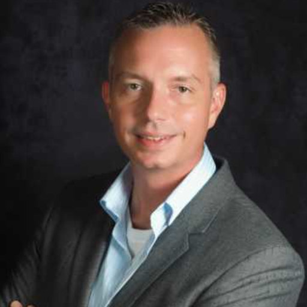    Picture from 2022    [Google Scholar]([https://scholar.google.com/citations?user=ytvnI68AAAAJ&hl=en](https://scholar.google.com/citations?hl=en&user=uHiSo1UAAAAJ)) | Kevin joined the lab as a Ph.D. student in 2015. In the lab, he developed new computational and mathematical approaches to investigate the interaction of phages (viruses of bacteria) and their bacterial hosts in mucus, producing one first-author publication in *Scientific Reports*. Kevin's position was supported by his DoD SMART Scholarship, the National Science Foundation S-STEM program, and the CSUPERB program. He completed his joined Ph.D. in Computational Science from San Diego State University & Claremont Graduate University in 2019.  | 

| [**Nicole Tomassi**](#nicole-tomassi) | Undergraduate Student and Research Assistant    **Ph.D. Candidate in Computational Neuroscience  at Boston University** since 2019 |
| 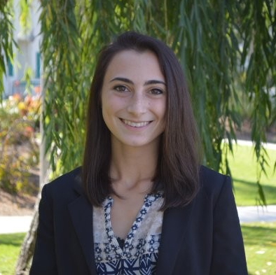    Picture from 2022    [LinkedIn](https://www.linkedin.com/in/nicole-tomassi-62151714b/) | Description TBD.  | 

| [**James Hellfeier**](#james-hellfeier) | Undergraduate Student and Research Assistant    **Senior Analyst, Manager at [LPL Financial](https://www.lpl.com/)** since 2021 |
| 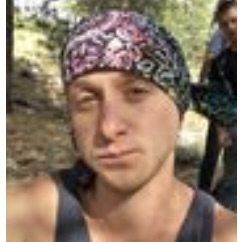    Picture from 2019    [LinkedIn](https://www.linkedin.com/in/james-hellfeier/) | Description TBD.  | 

| [**Max Anthenelli**](#max-anthenelli) | Undergraduate Student and Research Assistant    **Ph.D. Student in Education Policy and Leadership at the University of Maryland** since 2022 |
| 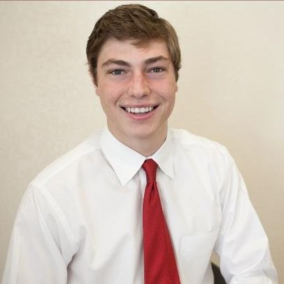    Picture from 2019    [LinkedIn](https://www.linkedin.com/in/max-anthenelli-642b8a116/) | Description TBD.  | 

| [**Fanwei (Ashley) Meng**](#ashley-meng) | Undergraduate Student and Research Assistant    **Software Engineer at Warner Bros. Discovery** since 2021 |
|     Picture from 2019    [LinkedIn](https://www.linkedin.com/in/fanwei-meng-1018/) | Description TBD.  | 

| [**Luke Turner**](#luke-turner) | Undergraduate Student and Research Assistant    **Optical Engineer at [Airy Optics, Inc.](https://www.linkedin.com/company/airy-optics/)** since 2022 |
| 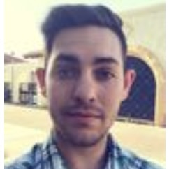    Picture from 2019    [LinkedIn](https://www.linkedin.com/in/luke-turner-509b87102/) | Description TBD.  | 

| [**Emily Jasien**](#emily-jasien) | Master Student and Research Assistant    Non-disclosable Information |
| 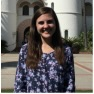    Picture from 2017    [LinkedIn](https://www.linkedin.com/in/emily-jasien-759a9a13b/) | Emily Jasien joined the lab to work on her research thesis *Modeling the transition between lytic and lysogenic behavior in a bacteria-phage system*. She completed her Master's in Applied Mathematics from San Diego State University in 2017.  | 

| [**Marcelo Sevilla**](#marcelo-sevilla) | Master Student and Research Assistant    **Business System Analyst at [TechFlow, Inc](https://www.linkedin.com/company/techflow-inc./)** since 2023 |
|     Picture from 2019    [LinkedIn](https://www.linkedin.com/in/marcelo-sevilla-74536450/) | Marcelo joined the lab in 2015 to study the major capsid protein of viral capsids as part of his Master in Computational Science. | 
