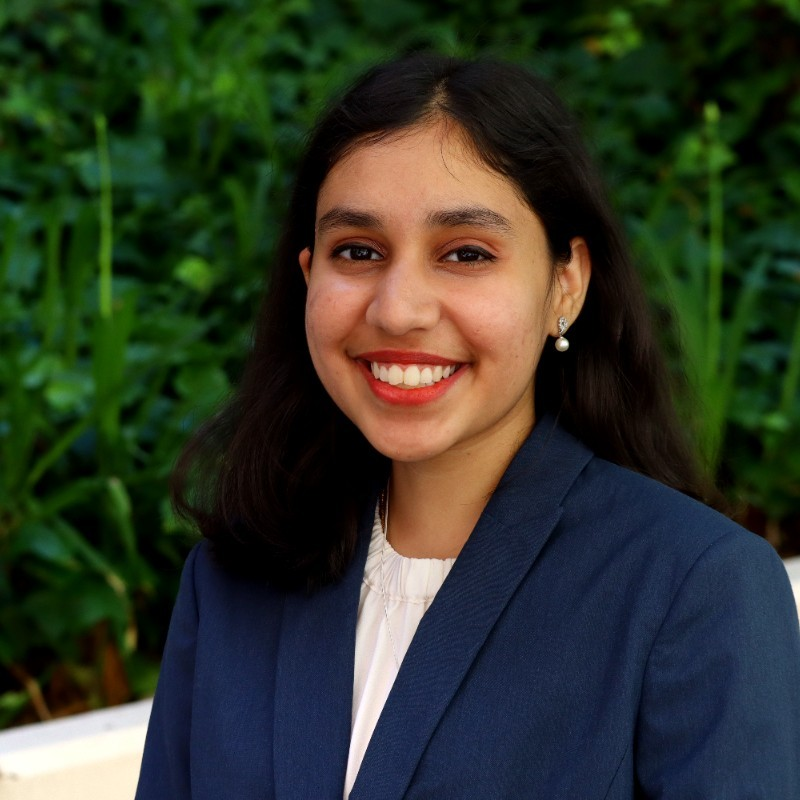
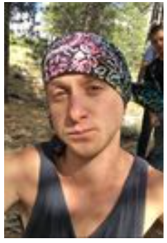
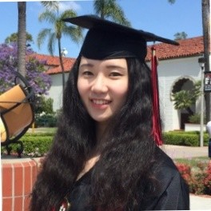
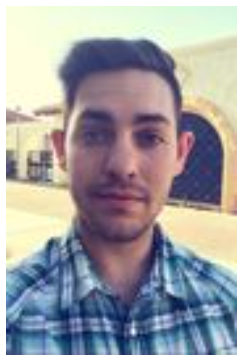
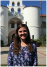
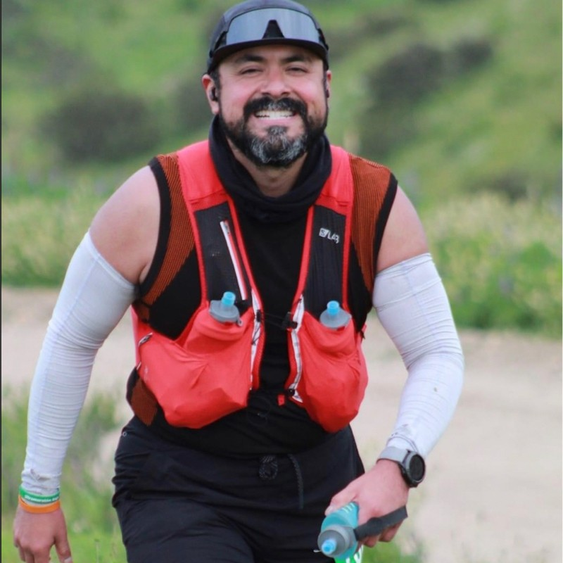

## Alumni 

| [**Colin Brown**](#colin-brown) | Master Student and Research Assistant-Scientist 2020–2023    **Junior Software Test Engineer at Holland AI LLC** since 2023 |
|     Picture from 2023    [LinkedIn]([?](https://www.linkedin.com/in/colin-travis-brown/)) | Colin was a research assistant and research scientist at the Luque lab from April 2020 to August 2023. Colin joined the lab to do research as part of his Master's thesis in physics, and he expanded his scope by developing geometrical and physical models to investigate the protein shell protecting the genome of viruses. He led the release and publication of pyCapsid in *Bioinformatics* and contributed to two additional research projects on viral capsids, yielding two co-author publications in *Microorganisms* and *bioRxiv*. Colin's position was supported by research funds from the National Science Foundation and the Gordon and Betty Moore Foundation. He received his Master's in Physics from San Diego State University in 2023. |

| [**Anuradha Agarwal**](#anuradha-agarwal) | Lab Technician 2022–2023    **Data Management Specialist at J.P. Morgan** since 2023 |
|     Picture from 2023    [LinkedIn](https://www.linkedin.com/in/anuradhagarwal/) | Anuradha (Anu) was a lab technician and manager at the Luque lab from January 2022 to May 2023. In the lab, Anuradha (Anu) was responsible for implementing, maintaining, and developing the data, computational, and culture processes operating in the lab. She developed extensive protocols and lab documentation and contributed to the first online release and publication of pyCapsid in *Bioinformatics*. Anu's position was supported by research funds from the National Science Foundation and the Gordon and Betty Moore Foundation. Anu received her Bachelor of Science in Mathematics from Rudgers University in 2021 and her Master in Computational Science from San Diego State University in 2023. While in the lab, she loved learning new languages and painting. | 

| [**Kevin Joiner**](#kevin-joiner) | Ph.D. Student and Research Assistant-Scientist 2015–2019    **Research Scientist at the [Naval Information Warfare Center (NIWC)](https://www.niwcpacific.navy.mil/careers/)** since 2020 |
|     Picture from 2022    [Google Scholar]([https://scholar.google.com/citations?user=ytvnI68AAAAJ&hl=en](https://scholar.google.com/citations?hl=en&user=uHiSo1UAAAAJ)) | Kevin joined the lab as a Ph.D. student in 2015. In the lab, he developed new computational and mathematical approaches to investigate the interaction of phages (viruses of bacteria) and their bacterial hosts in mucus, producing one first-author publication in *Scientific Reports*. Kevin's position was supported by his DoD SMART Scholarship, the National Science Foundation S-STEM program, and the CSUPERB program. He completed his joined Ph.D. in Computational Science from San Diego State University & Claremont Graduate University in 2019.  | 

| [**Nicole Tomassi**](#nicole-tomassi) | Undergraduate Student and Research Assistant    **Ph.D. Student at Boston University** since 2019 |
|     Picture from 2022    [LinkedIn](https://www.linkedin.com/in/nicole-tomassi-62151714b/) | Description TBD.  | 

| [**James Hellfeier**](#james-hellfeier) | Undergraduate Student and Research Assistant    **Senior Analyst, Manager at [LPL Financial](https://www.lpl.com/)** since 2021 |
|     Picture from 2019    [LinkedIn](https://www.linkedin.com/in/james-hellfeier/) | Description TBD.  | 

### Max Anthenelli
 \
Description : \
[Google Scholar]

### Ashley Meng
 \
Description :  \
[Google Scholar]

### Luke Turner
 \
Description : \
[Google Scholar]

### Emily Jasien
 \
Description :  \
[Google Scholar] \
Master in Applied Mathematics
Thesis: Modeling the transition between lytic and lysogenic behavior in a bacteria-phage system

### Marcelo Sevilla
 \
Description :
[Google Scholar] \
Email: msevilla1984@gmail.com
[Linkedin](https://www.linkedin.com/in/marcelo-sevilla-74536450/) 
