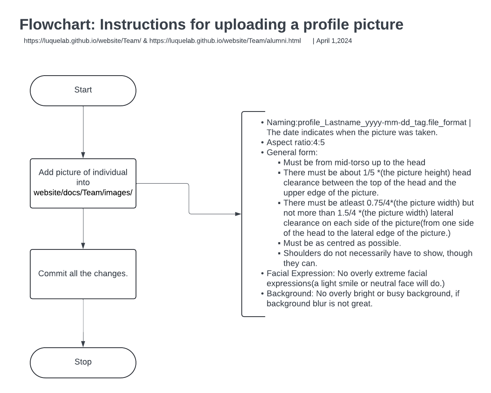

# Description
This folder contains all the profile pictures of team members.
# Instructions
- Naming: profile_Lastname_yyyy-mm-dd_tag.file_format | The date indicates when the picture was taken.
- Aspect ratio: 4:5  
- General form:  
	- Must be from mid-torso up to the head  
	- There must be about 1/5 *(the picture height) head clearance between the top of the head and the upper edge of the picture.  
	- There must be atleast 0.75/4*(the picture width) but not more than 1.5/4 *(the picture width) lateral clearance on each side of the picture(from one side of the head to the lateral edge of the picture.)  
	- Must be as centred as possible.  
	- Shoulders do not necessarily have to show, though they can.  
- Facial Expression: No overly extreme facial expressions(a light smile or neutral face will do.)  
- Background: No overly bright or busy background, if background blur is not great.

### Flowchart guide for instructions:
<figure>
  
</figure>

