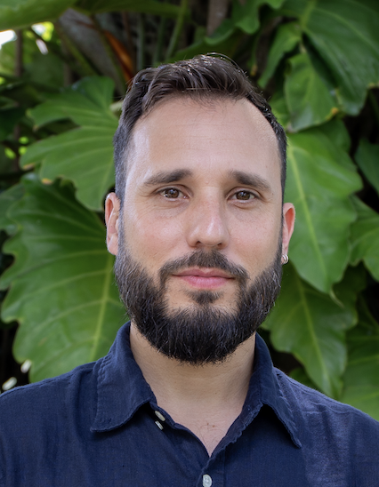

## Team 

| [**Antoni Luque, Ph.D.**](#antoni-luque) | **Associate Professor at the University of Miami** since 2023 |
|     Picture from 2023    [LinkedIn](https://www.linkedin.com/in/antoni-luque-phd/) | Antoni (Toni) is steering the lab to investigate the interplay between the physics and evolution of viruses. He received his Ph.D. in Physics in 2011 from the University of Barcelona and trained as a postdoc in Computational Biology at New York University from 2012 to 2014. Toni joined San Diego State University as an Assistant Professor in 2015 and was promoted to Associate Professor in 2021. He was hired as an Associate Professor at the University of Miami in 2023. He is a big F.C. Barcelona soccer fan and loves good food. |
| [Google Scholar](https://scholar.google.com/citations?user=ytvnI68AAAAJ&hl=en) | [Email](antoni.luque@miami.edu) &nbsp; [Functional resume](https://github.com/luquelab/website/blob/github-pages/resumes/Luque_functional_resume_2022-11-17.pdf) &nbsp;  [Academic CV](https://github.com/luquelab/website/blob/github-pages/resumes/Luque_academic_CV_2022-10-26.pdf) &nbsp;  [ORCID](https://orcid.org/0000-0002-5817-4914) |

| [**Sergio Cobo-López**](#sergio-cobo-lopez) | **Postdoc** since 2023 |
|     Picture from ....    [LinkedIn](https://www.linkedin.com/in/sergio-cobo-l%C3%B3pez-8706b2b9/) | Sergio Cobo-López is a postdoctoral researcher at the Luquelab and the Rohwerlab. He develops mathematical models for the ecology of bacteria and bacteriophage.Sergio received his Ph.D. in Physics from the Universitat Rovira i Virgili (Tarragona, Spain) in 2020 and joined San Diego State University that year. Since 2023, Sergio has been a Margarita Salas postdoctoral fellow. In his free time, he loves swimming, running, biking, and exercising in general. |
| [Email](srgcobo@gmail.com) &nbsp; | [CV](https://github.com/luquelab/website/blob/github-pages/resumes/sergio_cobo_cv.pdf) &nbsp; [Functional resume](#link) &nbsp; |

| [**Abelardo Aguilar**](#abelardo-aguilar) | **PHD Student** since 2023 |
|     Picture from 2024    [LinkedIn](https://www.linkedin.com/in/abelardo-aguilar-camara-158ba2263/?originalSubdomain=mx) | Description ...  |
| [Email](abelardoaguilar@miami.edu) &nbsp; | [CV](#link) &nbsp; [Functional resume](#link) &nbsp;  |

| [**Diana Lee**](#diana-lee) | **PHD Student** since 2016 |
|     Picture from ...    [LinkedIn](https://www.linkedin.com/in/diana-lee-98198a35/) | Description..... |
| [Email](lee9@rohan.sdsu.edu) &nbsp;   | [CV](#link) &nbsp; [Functional resume](#link) &nbsp; |

| [**Jose-Bernard Sedalo**](#jose-bernard-sedalo) | **Reasearch Assistant** since 2023 |
|     Picture from 2024    [LinkedIn](https://www.linkedin.com/in/jose-bernard-sedalo-2128a015b/?originalSubdomain=gh) | Description ...  |
| [Email](jss3466@miami.edu) &nbsp; | [CV](#link) &nbsp; [Functional resume](#link) &nbsp;  |
