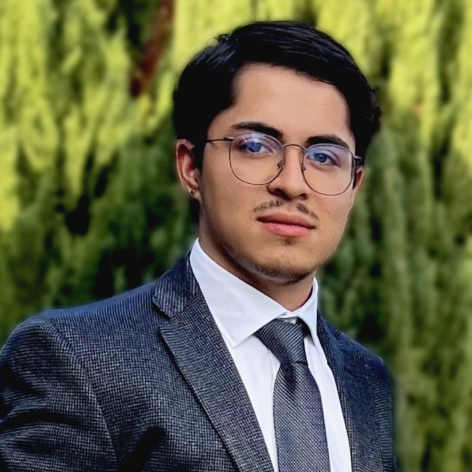
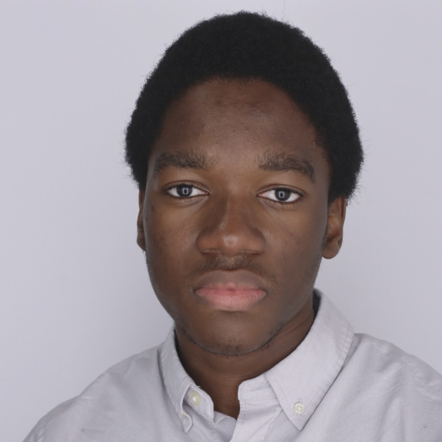

## Team 

| [**Antoni Luque, Ph.D.**](#antoni-luque) | **Associate Professor at the University of Miami** since 2023  Principal Investigator  Physical Virology |
|     Picture from 2023    [LinkedIn](https://www.linkedin.com/in/antoni-luque-phd/) | Antoni (Toni) is steering the lab to investigate the interplay between the physics and evolution of viruses. He received his Ph.D. in Physics in 2011 from the University of Barcelona and trained as a postdoc in Computational Biology at New York University from 2012 to 2014. Toni joined San Diego State University as an Assistant Professor in 2015 and was promoted to Associate Professor in 2021. He was hired as an Associate Professor at the University of Miami in 2023. He is a big F.C. Barcelona soccer fan and loves good food. |
| [Email](antoni.luque@miami.edu) &nbsp;| [Academic CV](https://github.com/luquelab/website/blob/github-pages/resumes/Luque_academic_CV_2022-10-26.pdf) &nbsp; [Functional resume](https://github.com/luquelab/website/blob/github-pages/resumes/Luque_functional_resume_2022-11-17.pdf) &nbsp; [Google Scholar](https://scholar.google.com/citations?user=ytvnI68AAAAJ&hl=en)  &nbsp;  [ORCID](https://orcid.org/0000-0002-5817-4914) &nbsp; |

| [**Sergio Cobo-López**](#sergio-cobo-lopez) | **Postdoc** since 2023 |
|     Picture from ....    [LinkedIn](https://www.linkedin.com/in/sergio-cobo-l%C3%B3pez-8706b2b9/) | Sergio Cobo-López is a postdoctoral researcher at the Luquelab and the Rohwerlab. He develops mathematical models for the ecology of bacteria and bacteriophage.Sergio received his Ph.D. in Physics from the Universitat Rovira i Virgili (Tarragona, Spain) in 2020 and joined San Diego State University that year. Since 2023, Sergio has been a Margarita Salas postdoctoral fellow. In his free time, he loves swimming, running, biking, and exercising in general. |
| [Email](srgcobo@gmail.com) &nbsp; | [Academic CV](https://github.com/luquelab/website/blob/github-pages/resumes/sergio_cobo_cv.pdf) &nbsp; [Functional resume](#link) &nbsp; |

| [**Omer Nadel**](#omer-nadel) | **Postdoc** since 2024 |
|  Picture from 2023 [Linkedin](https://www.linkedin.com/in/omer-nadel-946b90231/) | Omer Nadel is a postdoctoral researcher at the University of Miami in Antoni Luque’s lab, and at the San Diego State University in the Forest Rohwer’s lab. His research focuses on finding novel families of viruses and the implications of their evolutionary origins. Omer received his Ph.D. in Marine Microbiology in 2024 from the Technion - Israel Institute of Technology. In his free time, he like to play football and chase waves.|
| [Email](omernadel@gmail.com) &nbsp; | [Academic CV](https://github.com/luquelab/website/blob/github-pages/resumes/omer_nadel_cv_9_4_2024.pdf) &nbsp; [Functional Resume](https://github.com/luquelab/website/blob/github-pages/resumes/omer_nadel_resume_9_4_2024.pdf) &nbsp;  |

| [**Michael Cioffi**](#michael-cioffi) | **Postdoc** since 2024 |
|  Picture from 2023 [Linkedin](https://www.linkedin.com/in/mike-cioffi-phd/) | Michael (Mike) Cioffi is a postdoctoral researcher in the Luque Lab at the University of Miami. His research focuses on investigating the dynamics of viral capsid stability, assembly, and disassembly through various in silico techniques. Mike earned his Ph.D. in Physics (Computational Biophysics) from Florida international University in 2024 and joined the Luque Lab immediately after, bringing expertise in coarse-grained molecular dynamics simulations and molecular modeling.|
| [Email](mdc192@bio.miami.edu) &nbsp; | [Academic CV](https://github.com/luquelab/website/blob/github-pages/resumes/michael_cioffi_cv_2024-09-16.pdf) &nbsp; |

| [**Lucas Carbajal**](#lucas-carbajal) | **Research Associate** since 2024 |
|   Picture from 2024  [Linkedin](https://www.linkedin.com/in/lucas-carbajal-4777332b2/)|Lucas Carbajal is a Research Associate of the Luque lab at the University of Miami, having started as a volunteer in the summer. Lucas' work involves the dynamics of phage-bacterial systems under a weighted process methodology, which he hopes to expand to other systems and provide tools to analyze and predict changes in population processes over a multitude of scales. In his free time, he loves to read about history and art, and plays video games such as Call of Duty Zombies and Mount and Blade.| 
| [Email](lucascarbajal17@gmail.com) &nbsp; | [Academic CV](https://github.com/luquelab/website/blob/github-pages/resumes/LucasCarbajalCV%20Final.docx) &nbsp; |

| [**Abelardo Aguilar**](#abelardo-aguilar) | **PHD Student** since 2023 |
|     Picture from 2024    [LinkedIn](https://www.linkedin.com/in/abelardo-aguilar-camara-158ba2263/?originalSubdomain=mx) | Abelardo Aguilar is a PhD student at the University of Miami, working in Luque’s lab. His research focuses on the evolution and physics of viruses, using computational modeling and bioinformatics. Abelardo's work includes studying icosahedral capsids and developing evolutionary analysis tools. Previously, at the National Autonomous University of Mexico (UNAM), he researched the evolution of single-stranded DNA viruses. Besides research, Abelardo enjoys gaming on Linux and following Cruz Azul FC. Abelardo was once a professional Splatoon Gamer in Mexico. |
| [Email](abelardoaguilar@miami.edu) &nbsp; | [Academic CV](https://github.com/luquelab/website/blob/github-pages/resumes/Abelardo_Aguilar_academic_CV_2024-3-11.pdf) &nbsp; [Functional resume](https://github.com/luquelab/website/blob/github-pages/resumes/Abelardo_Aguilar_functional_resume_2024-3-11.pdf) &nbsp; |

| [**Md Imran Noor**](#md-imran-noor) | **PHD Student** since 2024 |
|  Picture from...   [Linkedin](https://www.linkedin.com/in/md-imran-noor-69abb9106/) &nbsp; | Noor is a Ph.D. student in Dr. Anthoni Luque’s Virus Ecology and Evolution Lab at the University of Miami. He was born and raised in Bangladesh, where he earned his bachelor’s degree in Fisheries and Marine Resource Technology from Khulna University. He also holds a master’s degree in Biochemistry and Molecular Biology from the University of Texas Rio Grande Valley. Noor’s current research in the Luque Lab focuses on engineering innovative and stable capsid designs for Adeno-Associated Viruses (AAV) that can accommodate larger genomes. This advancement could significantly enhance AAV’s potential as a vector in gene therapy applications. Outside of academia, Noor enjoys reading, watching movies, playing RPG and action-adventure games, and spending quality time with his family.|
| [Email](mxn833@miami.edu) &nbsp; | [Academic CV](https://github.com/luquelab/website/blob/github-pages/resumes/imran_noor_academic_cv_2024-08-14.pdf) &nbsp; |

| [**Michela Effendie**](#michela-effendie) | **Master's Student** since 2024 |
|  Picture from 2024  [Linkedin](https://www.linkedin.com/in/michela-tjan-sakti-effendie/) | Michela Effendie is a Master's in Data Science student at the University of Miami, working in the Luque lab and Data Science and Computational Biology lab. Her work focuses on deep learning and AI for various fields such as biology and medicine. She is currently building an AI research assistant for the lab. Besides research, Michela enjoys playing golf, rubik's cube, and Mario Kart.|
| [Email](mte42@miami.edu) &nbsp; | [Functional Resume](https://github.com/luquelab/website/blob/github-pages/resumes/michele_effendie_resume_9_4_2024.pdf) &nbsp; |

| [**Latim Jonathan**](#latim-jonathan) | **Master's Student** since 2024 |
|  Picture from... [Linkedin](https://www.linkedin.com/in/jonathanlatim/) | Jonathan Latim is a Master's in Data Science student at the University of Miami. He is currently working on building an AI research assistant in the Luque lab. He is an experienced Data Engineer with a background in Aerospace Engineering research. Outside of the lab, he enjoys watching soccer(Liverpool), engaging in physical exercise, and is very interested in reading and about longevity and how to optimize one's personal health.|
| [Email](jxl1683@miami.edu) &nbsp; | [Academic CV](https://github.com/luquelab/website/blob/github-pages/resumes/jonathan_latim_functional_resume_2024-09-16.pdf) &nbsp; |

| [**Jose-Bernard Sedalo**](#jose-bernard-sedalo) | **Research Assistant** since 2023 |
|     Picture from 2024    [LinkedIn](https://www.linkedin.com/in/jose-bernard-sedalo-2128a015b/?originalSubdomain=gh) | Jose Bernard is an undergraduate at the University of Miami, majoring in Computer Science and minoring in Mathematics and Biology. He is captivated by the potential of viral capsid structures in the field of nanotechnology and aspires to use deep learning tools to better predict and understand capsid behaviour. Outside the lab, he enjoys working out and watching Formula 1. |
| [Email](jss3466@miami.edu) &nbsp; | [Academic CV](#link) &nbsp; [Functional resume](#link) &nbsp; |
