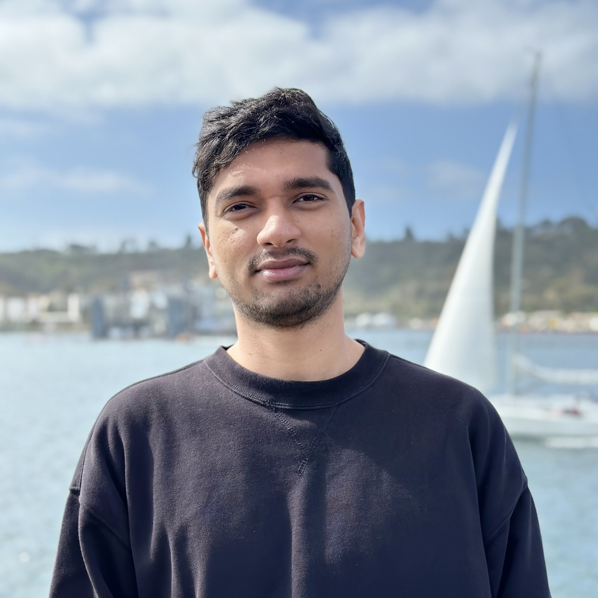
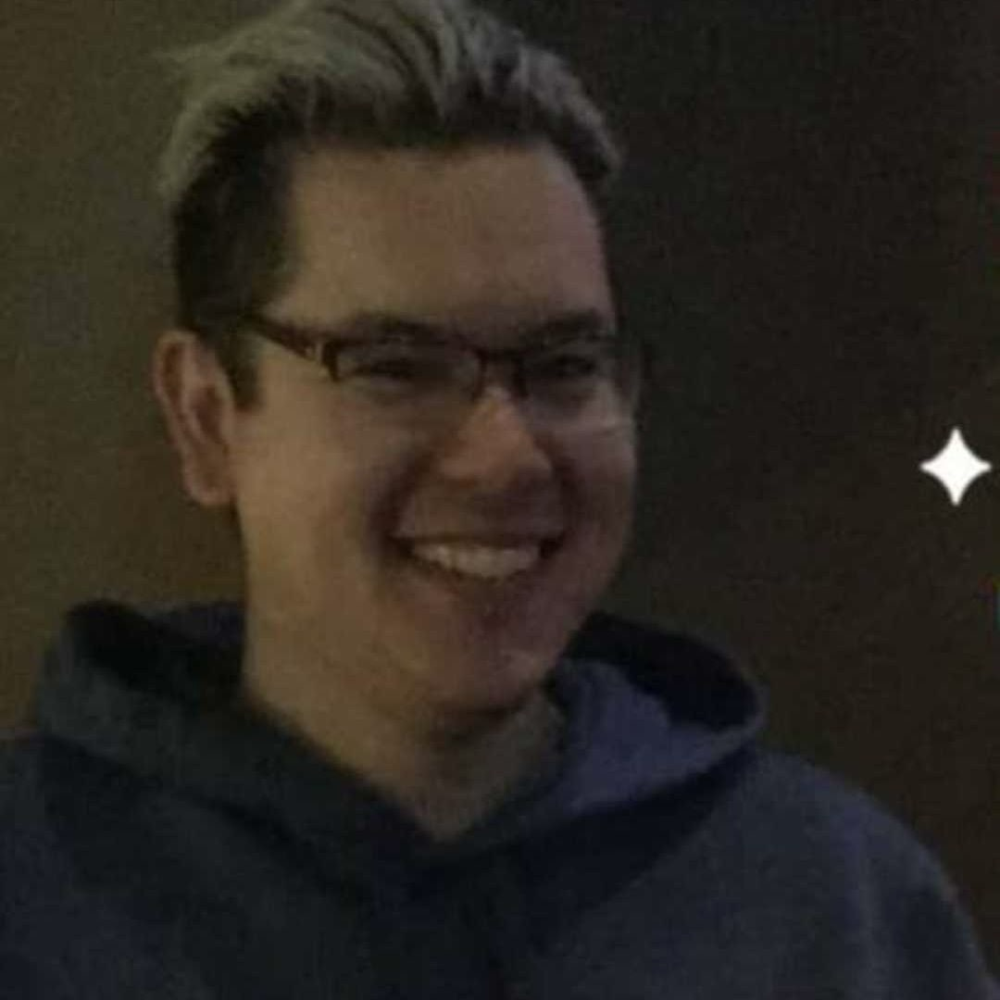

## Team 

| [**Antoni Luque, Ph.D.**](#antoni-luque) | **Associate Professor at the University of Miami** since 2023 |
|     Picture from 2021    [LinkedIn](https://www.linkedin.com/in/antoni-luque-phd/) | Antoni (Toni) is steering the lab to investigate the interplay between the physics and evolution of viruses. He received his Ph.D. in Physics in 2011 from the University of Barcelona and trained as a postdoc in Computational Biology at New York University from 2012 to 2014. Toni joined San Diego State University as an Assistant Professor in 2015 and was promoted to Associate Professor in 2021. He was hired as an Associate Professor at the University of Miami in 2023. He is a big F.C. Barcelona soccer fan and loves good food. |
| [Google Scholar](https://scholar.google.com/citations?user=ytvnI68AAAAJ&hl=en) | [Email](antoni.luque@miami.edu) &nbsp; [Functional resume](https://github.com/luquelab/website/blob/github-pages/resumes/Luque_functional_resume_2022-11-17.pdf) &nbsp;  [Academic CV](https://github.com/luquelab/website/blob/github-pages/resumes/Luque_academic_CV_2022-10-26.pdf) &nbsp;  [ORCID](https://orcid.org/0000-0002-5817-4914) |

### Jose-Bernard Sedalo
\
Reasearch Assistant\
[Email](jss3466@miami.edu)
[LinkedIn](https://www.linkedin.com/in/jose-bernard-sedalo-2128a015b/?originalSubdomain=gh)
### Abelardo Aguilar
\
PHD Student\
[Email](abelardoaguilar@miami.edu)
[LinkedIn](https://www.linkedin.com/in/abelardo-aguilar-camara-158ba2263/?originalSubdomain=mx)

### Amartya Yalla
 \
Lab Manager Assistant. \
Amartya Yalla is currently assisting the lab manager to carry and executing operational tasks in the lab. Amartya received his Bachelors in Computer Science from VIT University in 2021 and is completing his Masters in Computational Science at San Diego State University (expected in 2024). He likes swimming and painting. \
[Email](ayalla8921@sdsu.edu) \
[Functional resume](https://github.com/luquelab/website/blob/github-pages/resumes/amartya_yalla_resume.pdf) \
[LinkedIn](https://www.linkedin.com/in/amartya-yalla/) 

### Sergio Cobo-López
 \
Postdoc \
Sergio Cobo-López is a postdoctoral researcher at the Luquelab and the Rohwerlab. He develops mathematical models for the ecology of bacteria and bacteriophage.
Sergio received his Ph.D. in Physics from the Universitat Rovira i Virgili (Tarragona, Spain) in 2020 and joined San Diego State University that year. Since 2023, Sergio has been a Margarita Salas postdoctoral fellow. In his free time, he loves swimming, running, biking, and exercising in general.\
[Email](srgcobo@gmail.com) \
[CV](https://github.com/luquelab/website/blob/github-pages/resumes/sergio_cobo_cv.pdf) \
[LinkedIn](https://www.linkedin.com/in/sergio-cobo-l%C3%B3pez-8706b2b9/)

### Diana Lee
 \
PhD student \
DESCRIPTION..............\
[Email](lee9@rohan.sdsu.edu) \
[Functional resume](link?) \
[CV](link?) \
[LinkedIn](https://www.linkedin.com/in/diana-lee-98198a35/)

### James Mullinix
 \
PhD student \
DESCRIPTION.............\
[Email](jmullinix@mail.sdsu.edu) \
[Functional resume](link?) \
[CV](link?) \
[LinkedIn](https://www.linkedin.com/in/jamesmullinix/)

### Aurora Vogel
 \
Master student \
DESCRIPTION.............\
[Email](......) \
[CV](https://github.com/luquelab/website/blob/github-pages/resumes/aurora_vogel_cv.pdf) \
[LinkedIn](https://www.linkedin.com/in/aurora-vogel-7b7186196/)

### Brandon Ricafrente
 \
Master student \
Brandon is a physics Masters student in the Luque Lab . He received a B.S. in physics with a minor in math from UCR. During his time at UCR he studied bilipid membrane surface dynamics. He joined the lab in 2020 to study viral capsid assembly. He enjoys reading novels and swimming as hobbies.\
[Email](......) \
[Functional resume](https://github.com/luquelab/website/blob/github-pages/resumes/brandon_ricafrente_resume.pdf) 

### Caitlin Bartels
 \
Undergraduate student \
Caitlin Bartels has worked on a wide array of projects in the lab, specifically relating to capsid architecture and herpesvirales latency. Caitlin received her Bachelor of Science in Biology from San Diego State University in 2023 and is currently on track to apply to medical school this coming cycle. Caitlin joined the lab in 2020 to learn more about viruses amidst the Covid-19 pandemic. She loves traveling, arts & crafts, and playing waterpolo.\
[Email](caitlinbartels@gmail.com) \
[Functional resume](https://github.com/luquelab/website/blob/github-pages/resumes/caitlin_bartels_resume.pdf) \
[LinkedIn](https://www.linkedin.com/in/caitlin-bartels-a384891aa )

### Vaishnavi Patel
 \
Undergraduate student \
DESCRIPTION.............\
[Email](......) \
[Functional resume](link?) \
[CV](link?) \
[LinkedIn](LINK ?)

