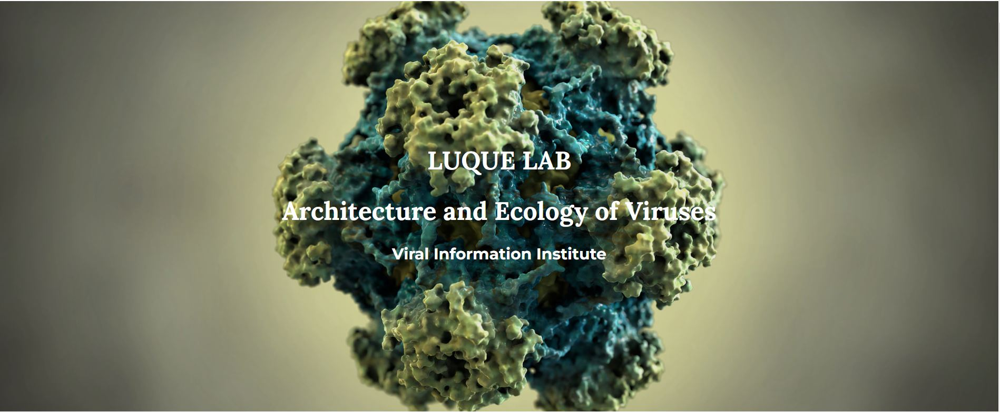

# Home

The Luque Lab investigates the physical structure and ecological properties of viruses by combining mathematical and computational models in close collaboration with experimentalists. The lab is part of the [Viral Information Institute (VII)](https://viralization.org/), the [Department of Mathematics and Statistics](https://math.sdsu.edu/) and the [Computational Science Research Center](http://www.csrc.sdsu.edu/) at [San Diego State University](http://www.sdsu.edu/).

## [Lab Documentation](https://luquelab.github.io/Athena/courses/)
## [News](https://www.luquelab.com/news.html)
# Latest News Updates
### [New Computational tool for Capsids](https://www.biorxiv.org/content/10.1101/2023.02.27.529640v1) |  March 1, 2023
 \
Project led by masters student [Colin Brown](https://www.linkedin.com/in/colin-travis-brown/) was released on [BioRxiv](https://www.biorxiv.org/) titled ["pyCapsid: Identifying dominant dynamics and quasi-rigid mechanical units in protein shells"](https://www.biorxiv.org/content/10.1101/2023.02.27.529640v1). The package [pyCapsid](https://luquelab.github.io/pyCapsid/) is available on GitHub, [Conda](https://anaconda.org/luque_lab/pycapsid) and [PIP](https://pypi.org/project/pyCapsid/) and the package installation steps are described [here](https://luquelab.github.io/pyCapsid/installation/). 

### [Application Submitted to NSF GRFP](https://www.nsfgrfp.org/) |  October 21, 2022
 \
Masters student Aurora Vogel submitted an application for [The National Science Foundation  Graduate Research Fellowship Program (GRFP)](https://www.nsfgrfp.org/). GRFP recognizes and supports outstanding graduate students who have demonstrated the potential to be high achieving scientists and engineers, early in their careers.  Vogel is investigating the geometry of conical capsids (like HIV) in the Luque lab and is a prospective Ph.D. student in Mathematics.

### [Invited seminar at UM](https://physics.as.miami.edu/events/seminars/index.html) | September 21, 2022
 \
Principal Investigator, Dr. Antoni Luque, was invited as a speaker at [the Fall 2022 seminar series](https://physics.as.miami.edu/events/seminars/index.html)  in the [Department of Physics](https://physics.as.miami.edu/) at [the University of Miami](https://welcome.miami.edu/) (UM). Dr. Luque shared the lab's progress in bridging the biophysics and evolution of viral capsids. The seminar was hosted by [Prof. Vivek N. Prakash](http://www.vprakash.com/). The seminar was preceded by a coffee with graduate students, postdocs, and other faculty.
